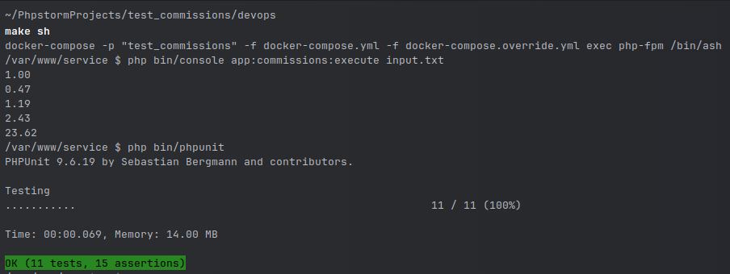

### Proposed solution for 
https://gist.github.com/PayseraGithub/634074b26e1a2a5e4b8d39b8eb050f9f

Use `make start` under `devops` directory for local deployment and `make sh` to connect to running container.

`php bin/console app:commissions:execute` expects input file path as an argument and will start the required logic.

### Notices:
- for `dev` (local) and `test` environments mock implementations for corresponding data providers introduced to both simplify development testing and as a display of meeting extendability requirement (any new adapter should implement corresponding `-DataProviderInterface` and can be easily rebind);
- to run the command with external interactions use `php bin/console app:commissions:execute --env=prod`;
- valid _Exchange Rates API_ access key should be set via `EXCHANGE_RATES_API_KEY` environment variable (`devops/.env`); 

### Execution and test results:
